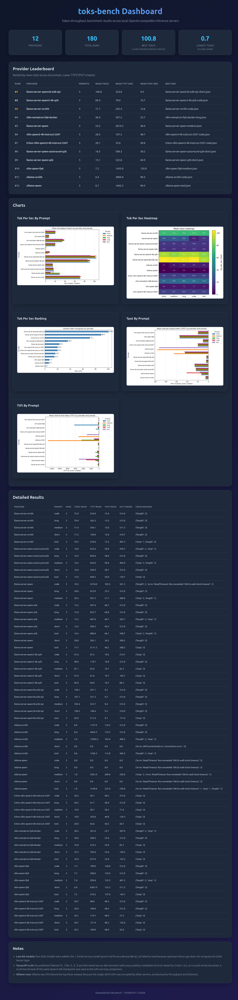
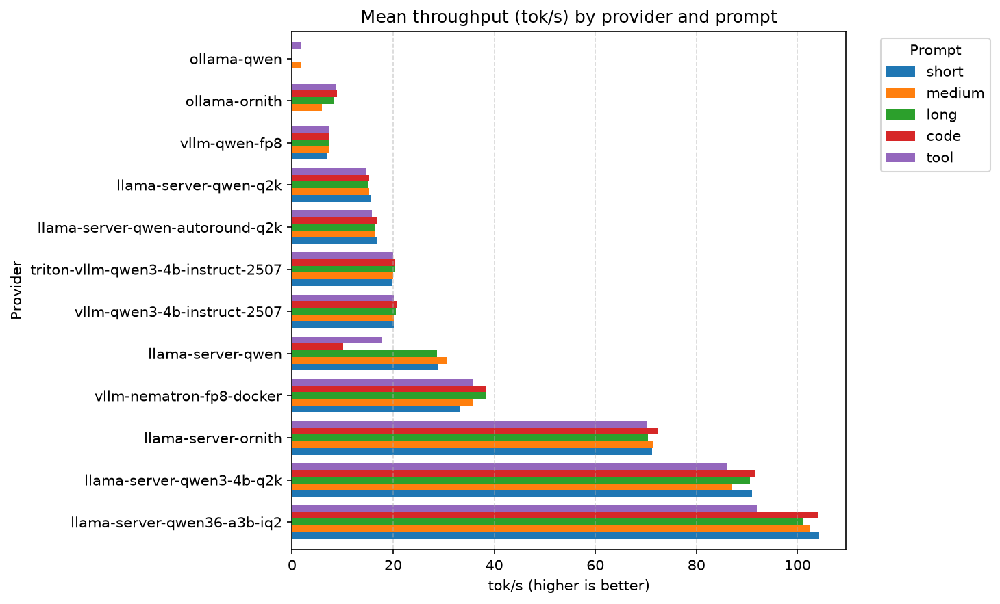

# toks-bench

Reproducible token-throughput benchmark for OpenAI-compatible LLM servers.

`toks-bench` sends the same prompts to one or more inference backends and reports
client-side throughput and latency metrics. It is designed to make it easy to
compare `llama.cpp` `llama-server`, Ollama, vLLM, and TensorRT-LLM deployments on
identical workloads.

## Example results

Dashboard overview:



Mean throughput (tok/s) by provider and prompt:



## What it measures

For each prompt, the tool issues `runs` streaming chat-completion requests and
records:

| Metric | Meaning |
|--------|---------|
| **TTFT** | Time to first token — request start until the first content chunk arrives. |
| **TPOT** | Time per output token — `(total_ms - ttft_ms) / (output_tokens - 1)`. |
| **tok/s** | Throughput: `output_tokens / (total_ms / 1000)`. |
| **Finish reasons** | How each run ended (`stop`, `length`, or `error: ...`). |

These are end-to-end, client-side numbers, so they include network serialization,
queueing, prefill, and token generation time. See [METHODOLOGY.md](METHODOLOGY.md)
for the full details on timeouts, failure handling, and how to run a reproducible
sweep.

## NVIDIA Spark and GB10 focus

This project is tuned for the NVIDIA Spark model recipes and for single-GPU
inference on a **GB10**. The stock
`config.yaml` and the helper scripts in `scripts/` and `run-*.sh` are set up for
Spark-compatible models such as:

- `nvidia/NVIDIA-Nemotron-3-Nano-30B-A3B-NVFP4`
- `nvidia/Gemma-4-26B-A4B-NVFP4`
- `nvidia/diffusiongemma-26B-A4B-it-NVFP4`
- `google/diffusiongemma-26B-A4B-it`

The included `toks-bench-profile` report is styled after the Spark-RAPIDS
Profiling Tool, so Spark users should find the layout familiar.

You can use the same tool on any OpenAI-compatible endpoint — the provider list
is just configuration in `config.yaml`.

## Supported backends

- `llama.cpp` `llama-server`
- Ollama (OpenAI compatibility endpoint)
- vLLM (OpenAI API server)
- TensorRT-LLM (OpenAI API server)

## Install

```bash
cd toks-bench
python -m venv .venv
source .venv/bin/activate
pip install -e ".[dev]"
```

## Quick start

Run against the local `llama-server` on port 8080:

```bash
toks-bench --provider llama-server-qwen --prompt short
```

Sweep all configured providers:

```bash
toks-bench --prompt short --all
```

Export JSON for plotting or aggregation:

```bash
toks-bench --provider llama-server-qwen --prompt short --format json --output results/llama-server-qwen-short.json
```

Override the number of runs or `max_tokens` for a quick experiment:

```bash
toks-bench --provider vllm-qwen-fp8 --prompt long --runs 5 --max-tokens 256
```

Tool prompts (those with a `tools` block in `config.yaml`) are automatically
benchmarked in tool-calling mode, or you can force it with `--mode tool`.

## Example output

```text
| Provider           | Runs | Tok mean | TTFT mean (ms) | TPOT mean (ms) | tok/s mean | tok/s median | tok/s p95 | tok/s std |
|--------------------|------|----------|----------------|----------------|------------|--------------|-----------|-----------|
| llama-server-qwen  | 10   | 512.0    | 45.2           | 8.1            | 123.4      | 125.0        | 135.0     | 5.2       |
| vllm-qwen-fp8      | 10   | 512.0    | 38.7           | 6.4            | 156.8      | 158.0        | 168.0     | 4.1       |
```

The JSON output also contains every individual run with per-token timestamps, so
you can dig into outliers or replot the data yourself.

## Interpreting the results

- **TTFT** is dominated by prompt prefill and queueing; it grows with prompt
  length and batch size.
- **TPOT** reflects per-token generation latency; improvements come from faster
  kernels, lower batching, or quantization.
- **tok/s** is the headline throughput metric. Compare it at the same
  `max_tokens` and prompt, because output length affects the average.
- A lot of `length` finish reasons means generations hit `max_tokens`; `stop`
  means the model emitted an end-of-sequence token.

## Running a full sweep and generating reports

```bash
cd toks-bench
source .venv/bin/activate
mkdir -p results/full

for prompt in short medium long code tool; do
  toks-bench --prompt "$prompt" --all --format json \
    --output "results/full/all-${prompt}.json"
done

# Aggregate CSV + markdown table
toks-bench-aggregate results/full

# Spark-RAPIDS-style profiling report
toks-bench-profile --results-dir results/full --csv results/aggregate.csv

# PNG charts
toks-bench-chart --csv results/aggregate.csv --output-dir results/charts

# HTML dashboard
python scripts/generate_dashboard.py --csv results/aggregate.csv \
  --charts results/charts --output results/dashboard.html
```

For a long-running sweep, run it in a `tmux` session so it survives disconnection.

## Confirm the results and share yours

These numbers are measured on a specific stack (driver, CUDA, vLLM/llama.cpp
version, GPU clocks, batch size of one, etc.). **Please reproduce them on your
own hardware before trusting them.**

If you run `toks-bench` on a GB10, another GPU, or a different server build and
want to share your numbers, open a PR with:

- the JSON result files,
- the exact server launch command or script,
- GPU/driver/CUDA/library versions,
- and any relevant `config.yaml` changes.

We’re happy to add confirmed results to the project so the community can compare
real-world deployments.

## Methodology and configuration

See [METHODOLOGY.md](METHODOLOGY.md) for details on measured metrics, prompts,
timeouts, failure handling, and how to run a reproducible full sweep.

Edit `config.yaml` to add or remove providers, prompts, and default parameters
without changing code.

## License

MIT — see [LICENSE](LICENSE).
